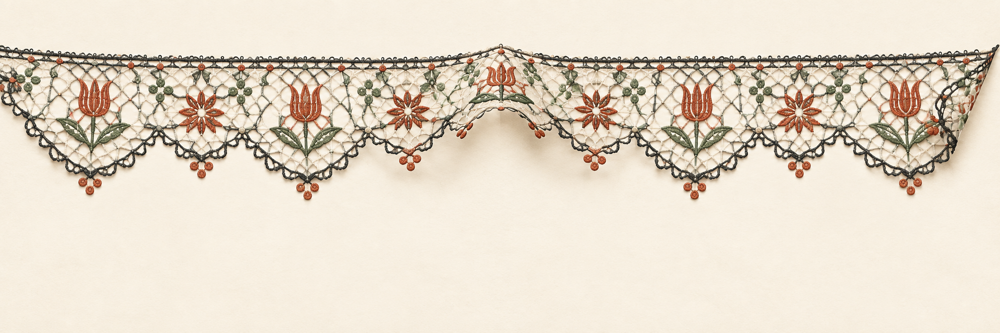
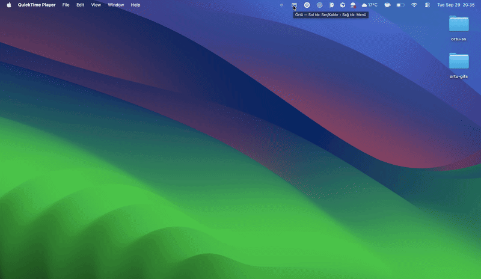
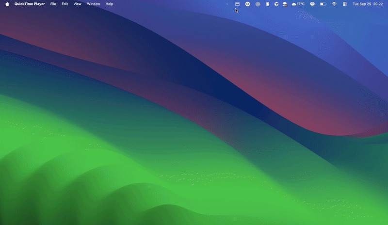
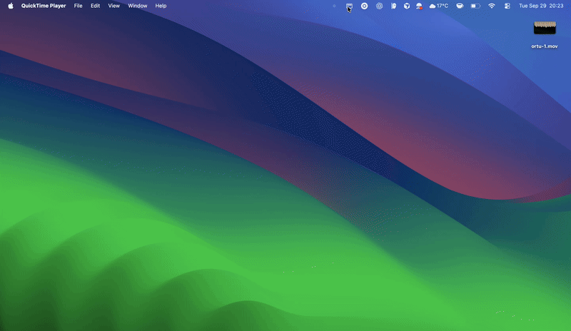
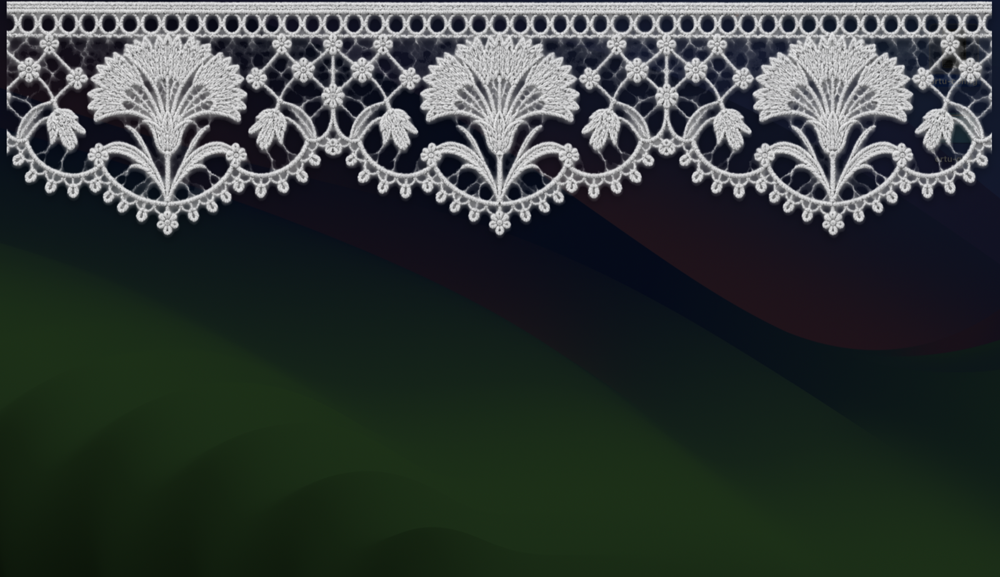
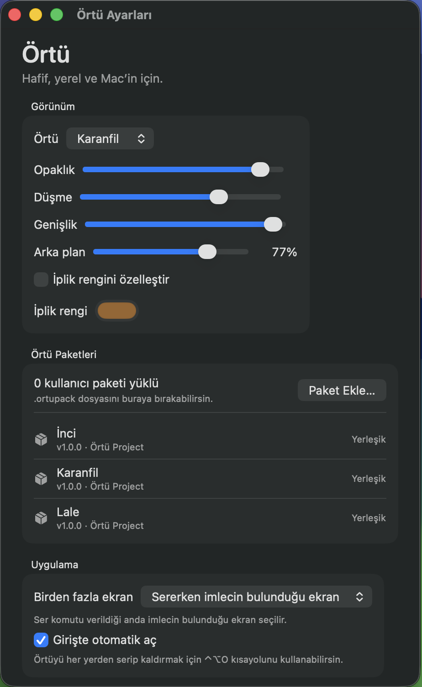

# Örtü

<p align="center">
  
</p>

## See it in action

### One click from the menu bar

<p align="center">
  
</p>

### Drape, shape, and fold

<p align="center">
  
</p>

### Make it yours

<p align="center">
  
  
</p>

## Screenshots

### A calm desktop cover

<p align="center">
  
</p>

### Native macOS settings

<p align="center">
  
</p>

[](https://github.com/fufuceng/ortu/actions/workflows/ci.yml)
[](https://github.com/fufuceng/ortu/actions/workflows/codeql.yml)

Örtü is a lightweight, native macOS menu bar app that places a decorative cover over the desktop.

The project is MIT licensed, fully offline, and designed to do no work while idle. See [CONTRIBUTING.md](CONTRIBUTING.md) before proposing changes and [docs/architecture.md](docs/architecture.md) for the engineering boundaries.

Canonical repository: [github.com/fufuceng/ortu](https://github.com/fufuceng/ortu).

This repository currently contains a runnable native prototype:

- AppKit menu bar lifecycle and SwiftUI settings
- AppKit overlay windows
- Multi-display lifecycle handling
- Point-aware cloth deformation while dragging, with a short spring return
- Drag upward or press Escape to remove the cover
- Seven selectable original cover packs: `İnci`, `Lale`, `Papatya`, `Selçuk`, `Karanfil`, `Rûmî`, and `Yıldız`
- Optional dynamic thread color that preserves lace shading and transparency
- Adjustable background dimming from `0%` to fully black (`100%`)
- Multi-display policy: all displays, primary display, or the display under the pointer when draping
- Validated import and rendering of external `.ortupack` bundles
- Left-click the menu bar icon to drape/fold; right-click for settings and controls
- System-wide `⇧⌘O` shortcut and an optional launch-at-login setting
- English and Turkish localization while preserving the Örtü name and `.ortupack` terminology
- No timers, polling, networking, analytics, or background rendering

The cloth mesh is redrawn only while the user is dragging and during the brief release animation. At rest, there is no animation loop. macOS **Reduce Motion** removes the spring return.

Tinted textures are rendered and cached only when the selected pack or thread color changes; color customization adds no idle render loop.

## Cover packs

Distributed `.ortupack` files are ZIP archives containing only declarative metadata and image assets. Örtü rejects scripts, executables, nested directories, symbolic links, traversal paths, oversized images, unknown files, and checksum mismatches. Packs are expanded into a private staging directory and moved into Application Support only after validation succeeds.

Packs can be selected in Settings, dropped onto the package area, or opened from Finder. The package manager can update, reveal, and remove user-installed packs; built-in packs remain protected. Creation commands and the complete v1 format are documented in [`docs/ortupack-v1.md`](docs/ortupack-v1.md).

All bundled packs use original, project-owned artwork and go through the same manifest and checksum validation path as imported packs.

Supported package licenses in the first schema are `CC0-1.0`, `CC-BY-4.0`, and `MIT`.

## Requirements

- macOS 13+
- Xcode 16.3+ or a compatible Swift 6.1+ toolchain

## Build and run

```sh
./scripts/package-local.sh
open dist/Ortu.app
```

The packaging script creates an ad-hoc signed local app bundle. Production releases will use a Developer ID signature and Apple notarization.

## Test

```sh
make check
```

The complete quality gate runs formatting checks, warnings-as-errors compilation, the Swift test suite with coverage, release packaging, signature verification, and validation of every built-in cover pack. See [docs/testing.md](docs/testing.md) for individual commands and the manual release matrix.

The app runs as a menu bar accessory. Choose **Örtüyü Ser** to show the overlay. Drag upward or press Escape to remove it.

For a release-mode overlay smoke test without using the menu, run:

```sh
dist/Ortu.app/Contents/MacOS/Ortu --drape
```
